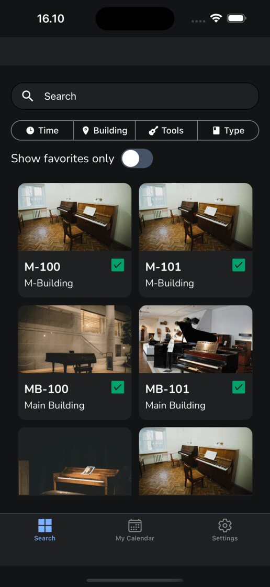
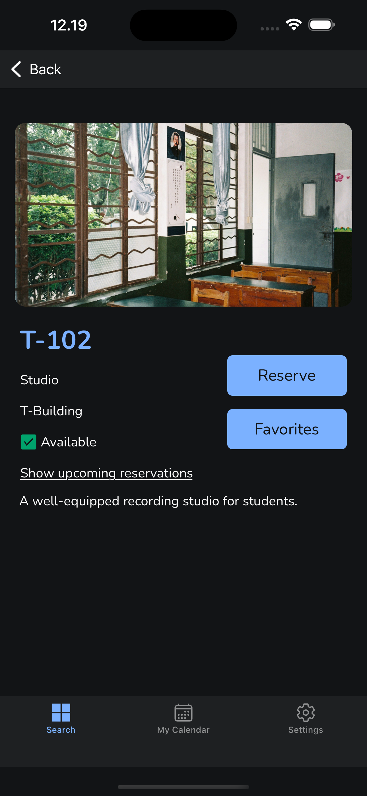
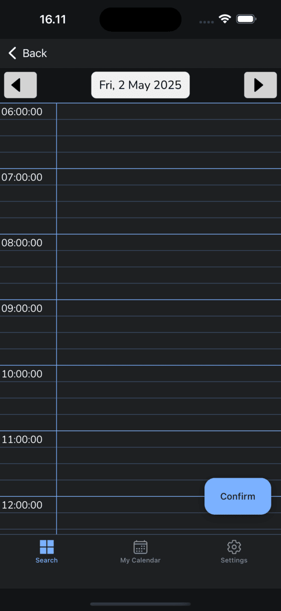

## 🎻 Room Reservation App 

This is a final project implemented for the [Full Stack Open course](https://fullstackopen.com/en/) at the [University of Helsinki](https://www.helsinki.fi/en).

This project is a full-stack application designed for music school students and teachers. It allows users to book different study facilities such as practice rooms, classrooms, and more.

This repository contains the frontend part of the application. Built with [TypeScript](https://www.typescriptlang.org/), [React Native](https://reactnative.dev/), and [Expo](https://expo.dev/), it supports both native mobile and web platforms.

### Links to other parts of the project:

- Backend repo: https://github.com/DarjaElina/room-reservation-app-backend
- Account activation page repo: https://github.com/DarjaElina/account-activation-page

### ⏰ Work hours 

[Link to work hours listing](https://github.com/DarjaElina/room-reservation-app/blob/main/workHours.md)

### ✨ Features

- JSON Web Token authentication (login, registration, refresh)
- Full room booking CRUD: create, view, update, cancel
- Filter rooms by time, type, building, and available tools
- Paginated room list with infinite scroll
- Localization with [typesafe-i18n](https://www.npmjs.com/package/typesafe-i18n/v/2.21.1)
- Cross-platform support: Web, Android, iOS
- Testing with [Jest](https://jestjs.io/) and [Maestro](https://docs.maestro.dev/)
- CI/CD with [GitHub Actions](https://github.com/features/actions): linting, tests, web deploy, and Expo development builds
- Uses two backend environments: staging (for testing and dev builds) and production (for deployed web)
- Automatic username generation and email-based registration for testing

> Note: While localization is supported in the UI, some static data (e.g., room and building names, tools) is still in English. I’m aware of this and plan to internationalize the database content in a future update.
  
### 🏁 Getting Started

This project supports both Android and iOS development builds for easy testing across platforms.

#### 🤖 Android Development Build

- ➡️ [Download Android build](https://expo.dev/accounts/daria111/projects/mobile-frontend/builds/4cd620d7-d128-45fc-9a96-8c5c169302fd)

Then follow the instructions to install the APK file.

#### 🍎 iOS Development Build (Simulator only, Mac and [XCode](https://developer.apple.com/xcode/) required)

Unfortunately, I found no easy way to share and run the iOS development build without an Apple Developer account.
If you still would like to test the iOS build, you can do the following:

1) Download the **room-reservation-app.tar.gz** file from from [this GitHub release](https://github.com/DarjaElina/room-reservation-app/releases/v0.0.3)
2) Extract the file by doubleclicking it
3) Open the iOS simulator (requires XCode)
4) Drag and drop the extracted file into the Simulator window

#### 🛠️ Alternatively, for local development
If you have Xcode installed and want to build the app locally:

``` bash
npx expo run:ios
```

### 🌐 Web Deployment
The web version lives here: [https://mobile-frontend.expo.app](https://mobile-frontend--u2zj3se9p2.expo.app/calendar)

#### You can log in using:
- Username: jd10000
- Password: password

#### 🧪 Or if you'd like to test the full account activation flow:
1. Visit [this link](https://account-activation-page.vercel.app/)
2. Enter your email address
3. The system will generate a username and let you set a password

### Screenshots

#### Home Screen


---

#### Room View


---

#### Time Picker


More screenshots can be found [here](https://github.com/DarjaElina/room-reservation-app/tree/main/screenshots)

#### Notes about CI tests
Currently, E2E tests are not part of the CI pipeline. The tests can be run locally, but they tend to break in the CI environment due to timeouts and app crashes, likely caused by the emulator running inside a virtualized CI setup. Unfortunately, I haven’t set up a Maestro Cloud paid subscription for running tests in a more stable environment. 😁

For a more consistent testing experience, I recommend running the Maestro tests locally in a simulator.


### 🧡 Acknowledgments
Huge thanks to the [Full Stack Open](https://fullstackopen.com/en/) team for creating such a fantastic, free, and super educational course. It’s been a joy studying the materials and completing projects! 🙏✨


